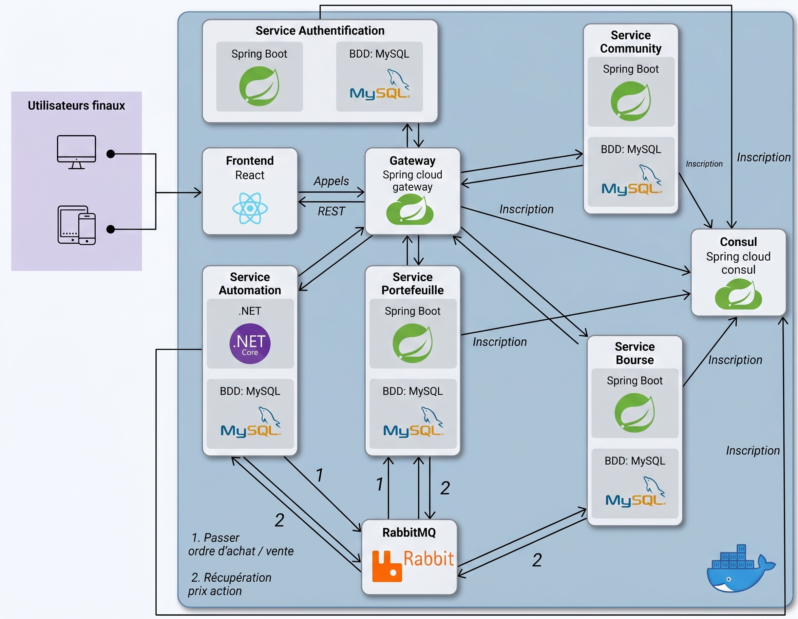

# StockMarketSimulation

Stock market simulation platform. Allows users to practice and test their investment strategies without taking financial risks.

## Architecture

Client requests from the frontend are routed through a Spring Cloud Gateway (with Consul for service discovery), while internal inter-service communication is handled asynchronously via RabbitMQ (for order execution and price synchronization). Each microservice maintains its own dedicated MySQL database.

<p align="center">
  
</p>

## Installation

```bash
docker compose up -d
```

Open [http://localhost:3000](http://localhost:3000) in your browser.

## API Documentation

Each service provides interactive Swagger documentation:

- [Bourse](http://localhost:8083/swagger-ui.html)
- [Portefeuille](http://localhost:8085/swagger-ui.html)
- [Auth](http://localhost:8081/swagger-ui.html)
- [Community](http://localhost:8082/swagger-ui.html)

## Environment Variables

Optional variables if you want to provide your own API keys (defaults are already included for local testing):

| Variable | Description |
| :--- | :--- |
| `FMI_API_TOKEN` | Financial Modeling Prep API key |
| `ALPHAVANTAGE_API_TOKEN` | AlphaVantage API key |
| `JWT_PRIVATE_KEY` | RSA private key path (Auth) |
| `JWT_PUBLIC_KEY` | RSA public key path |

## Test Account

To test the application with pre-existing data:
- Log in or register with username: **`Alex`** (has pre-loaded portfolio assets and past transactions).